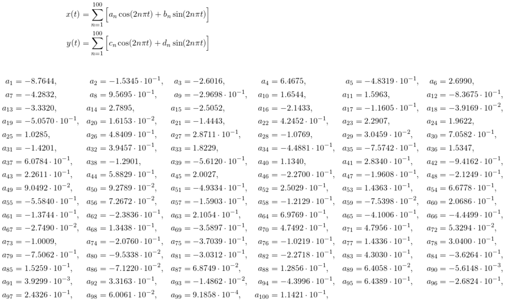

# Graph-maker
This program takes an image of a curve, either svg or png, and approximates it by Fourier series. The program outputs a picture of the graph and the equations of the approximation in LaTeX code. 

## Getting started
Alls ya need is the file `graph_maker.py` and the folder named `tools`, which contains the bulk of the code. Put them in a folder with the image you want to graphify, and follow the below instructions.

The rest of the files you can safely delete.

### Prerequisites
You will need to have Python and the packages Numpy, matplotlib, and PIL installed in order to run the python script.

Paths saved in svg-format can be drawn with programs like InkScape.

Curves drawn in png-files can be made using for instance MS-Paint or PS.

## Typical usage
Run the script in terminal with Python 3 as follows,
```
$ python3 graph_maker.py image.png output.png 100
```
where
 * `image.png` is the name of the image being made into a graph
 * `output.png` is the name you want for the output file
 * `100` is the number of terms to be used in the Fourier series

## Requirements on the image files

### PNG - Drawing the curve in MS-Paint
You can draw your curve in MS-Paint and use the image file with this script. Here is an example of such a drawing:


Notice that the image is in black and white. The curve is represented by the border between the two colours.

After running the script on this file in terminal, as
```
$ python3 graph_maker.py hybrida.png hybrida_graph.png 100
```
The result is the following graph, along with latex-code in separate files.


The result looks goofy in this case, but a quick fix is to increase the order from 100, e.g. to 300.

Here is a detailed guide on drawing curves in this way:
1. First, draw the curve in black on a white background. Make sure there is no antialiasing (gray colours mixed in to make the drawing look more smooth).
2. Make sure the curve does not intersect itself! It must also be closed and connected, that is you cannot lift the pencil and have to return to the starting point.
3. Once you are done drawing the curve, use the paint-bucket to fill in the outside of the curve with black colour.

After this you should have a black/white picture that is black on the outside of the curve and white on the inside, with no islands of either colour in the other region. There should also not be any grey-tones on the border between them. If you see that there are, try using other editing software to colour these pixels either white or black.

**NOTE ON PERFORMANCE**: Try not to use a picture with too high resolution. Right now, the program treats the path as x- and y-coordinates in two separate vectors, one value in each for every pixel along the border. The program finds their representation in a cosine/sine basis, using two N-by-M matrices containing cosine- and sine-values. Computing the value of this matrix can become costly if M (the length of the x- and y-vector) becomes huge, i.e. if the resolution is high.

**BOTTOM LINE**: If the resolution is high, the number of pixels along the border will be large, making the x- and y-vectors long, which in turn increases the computation time.

There is a fix for this planned, but for the moment, just scale down the image. Something of the order 500x500 - 1000x1000 should be fine.

### SVG - Drawing a path in InkScape
This will perhaps lead to the most elegant graphs. Using svg-paths is not as restrictive as the black/white drawings detailed above, because there is nothing preventing your graph from intersecting itself in this case. The curve must still end up at its starting point and be one connected path, but other than that there aren't many limitations.

Here is how you might go about doing this:
1. Find an image that you like and want to make a graph of
2. Open it in InkScape

	
	
3. Use the Bezier tool to trace out a curve on top of the image.

	
	
4. Make sure the curve you are making is connected! It has to be made using just one path, and also has to return to the starting point in the end.
5. When you are done drawing the curve and close it off, it should change thickness and turn black.
6. You can now delete the picture you used as a guide from the drawing board, leaving the curve still there.

	
	
7. Before saving the curve, make sure that InkScape is set up to save coordinates as absolute, not relative:
	1. Go to `Edit -> Preferences -> SVG-output -> Path data -> Path string format`
	2. Choose `Absolute`
	
	
	
8. Save the curve as an svg-file.

Now, simply run the script as described above with the filename you chose for the svg file.

## LaTeX code
The program produces two files containing LaTeX code describing the graph mathematically. The two files,
1. `latex_simple.tex`: contains code for a simpler set of equations that will generate the graph (left below)
1. `latex_complete.tex`: contains the complete equations that generate the graph, without relying on the Sigma-notation for sums (right below)




## Future work
The plan to fix the resolution dependence for png input is as follows:
* Make a linear spline *s*(*t*) out of the path generated from the image, 0 ≤ *t* < 1
* Sample the spline at some low rate, like at *n*=1000 equidistant points
* Make another linear spline *s_n*(*t*) form these *n* samples, and compute the error *e* = ∫(*s-s_n*)²d*t*
	* If *e* is sufficiently small (to be defined), accept the sample of $n$ points that was made
	* Else, increase *n* by some factor and try again.
