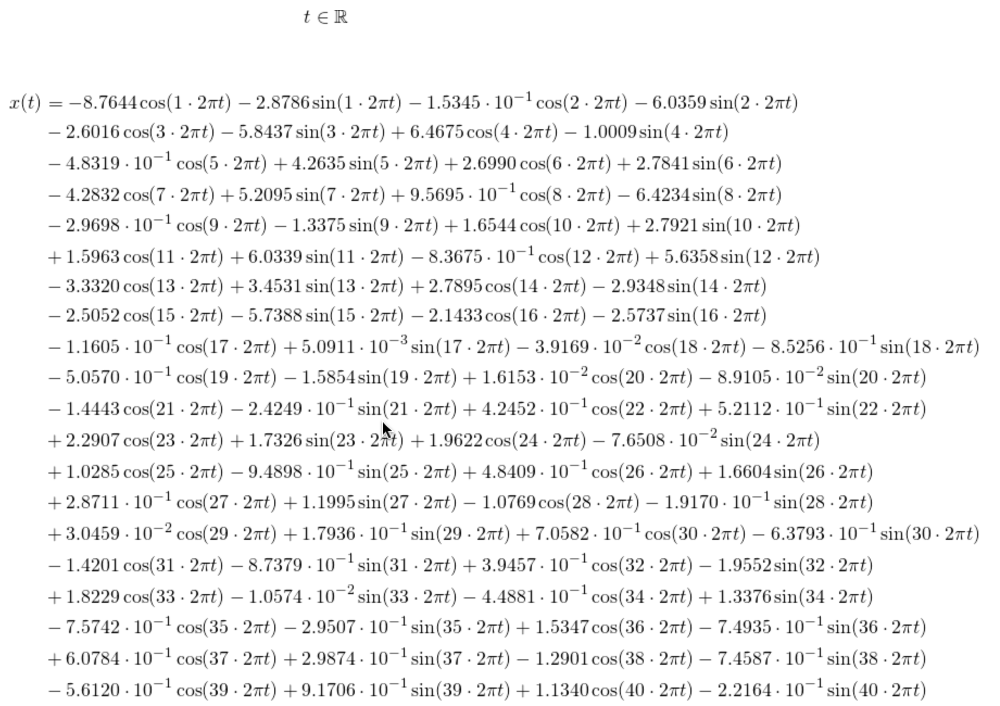

# Graph-maker
This program takes an image of a curve, either svg or png, and approximates it by Fourier series. The program outputs a picture of the graph and the equations of the approximation in LaTeX code. 


## Getting started
The parts of this repo that do all the work are the file `graph_maker.py` and the folder named `tools`, which contains the bulk of the code. Put them in a folder with the image you want to graphify, and follow the below instructions.

The rest of the files you can safely delete.

### Prerequisites
Alls ya need to run the script is to have Python installed along with the packages Numpy, matplotlib, and PIL.

Curves drawn in png-files can be made using for instance MS-Paint, GIMP, or PhotoShop.

Paths saved in svg-format can be drawn with vector-graphics programs like InkScape.


## Typical usage
Run the script in terminal with Python 3 as follows,
```
$ python3 graph_maker.py <input-file> <output-file> <fourier-order>
```
where
 * `<input-file>` is the name of the image being made into a graph, e.g. `image.svg`
 * `<output-file>` is the name you want for the output file, e.g. `image_graph.png`
 * `<fourier-order>` is the number of terms to be used in the Fourier series, e.g. `100`

Additionally, one may apply the optional fourth decimal-number argument `<scaling-factor>`,
```
$ python3 graph_maker.py <input-file> <output-file> <fourier-order> <scaling-factor>
```
which scales the number of sample points along the curve up or down. By default, the number of sample points is decided by the resolution of the image, in the png-input case, or the number of Bezier curves in the path, for the svg-input case. A scaling factor smaller than 1 will reduce the number of sample points proportionally and lead to quicker run times, whereas numbers larger than 1 may result in better detail.


## Requirements on the image files

### PNG - Drawing the curve in MS-Paint
You can draw your curve in MS-Paint and use the image file with this script. Here is an example of such a drawing:


Notice that the image is in black and white. The curve is represented by the border between the two colours.

After running the script on this file in terminal, as
```
$ python3 graph_maker.py hybrida.png hybrida_graph.png 100
```
The result is the following graph, along with latex-code in separate files.


The result looks goofy in this case, but a quick fix is to increase the order from 100, e.g. to 300.

Here is a detailed guide on drawing curves in this way:
1. First, draw the curve in black on a white background. Make sure there is no antialiasing (gray colours mixed in to make the drawing look more smooth).
2. Make sure the curve does not intersect itself! It must also be closed and connected, that is you cannot lift the pencil and have to return to the starting point.
3. Once you are done drawing the curve, use the paint-bucket to fill in the outside of the curve with black colour.

After this you should have a black/white picture that is black on the outside of the curve and white on the inside, with no islands of either colour in the other region. There should also not be any grey-tones on the border between them. If you see that there are, try using other editing software to colour these pixels either white or black.

**NOTE ON PERFORMANCE**: If you are using an image with very high resolution, you may want to run the program with the optional fourth argument set to some number smaller than 1, e.g. `0.5` or `0.2`, as
```
$ python3 graph_maker.py hybrida.png hybrida_graph.png 100 0.5
```
This has the effect of reducing the number of sample points around the curve, which means the numerical Fourier transformation will be far less computationally costly. This works fine, so long as you do not get too greedy and scale the number of samples down so far that it becomes lower than the order of the Fourier series. But you should be running into issues with the aesthetics of the graph long before this becomes a concern.

### SVG - Drawing a path in InkScape
This will perhaps lead to the most elegant graphs. Using svg-paths is not as restrictive as the black/white drawings detailed above, because there is nothing preventing your graph from intersecting itself in this case. The curve must still end up at its starting point and be one connected path, but other than that there aren't many limitations.

Here is how you might go about doing this:
1. Find an image that you like and want to make a graph of
2. Open it in InkScape

	
	
3. Use the Bezier tool to trace out a curve on top of the image.

	
	
4. Make sure the curve you are making is connected! It has to be made using just one path, and also has to return to the starting point in the end.
5. When you are done drawing the curve and close it off, it should change thickness and turn black.
6. You can now delete the picture you used as a guide from the drawing board, leaving the curve still there.

	
	
7. Before saving the curve, make sure that InkScape is set up to save coordinates as absolute, not relative:
	1. Go to `Edit -> Preferences -> SVG-output -> Path data -> Path string format`
	2. Choose `Absolute`
	
	
	
8. Save the curve as an svg-file.

Now, simply run the script as described above with the filename you chose for the svg file.


## LaTeX code
The program produces three files containing LaTeX code describing the graph mathematically. The two files,
1. `latex_simple.tex`: contains code for a simple set of equations that will generate the graph


2. `latex_simplest.tex`: contains code for an even simpler set of equations that will generate the graph 


3. `latex_complete.tex`: contains the complete equations that generate the graph, without relying on the Sigma-notation for sums 



## Future work
* Add behaviour: Let the output graph be in the complex plane, and the LaTeX code be a sum over complex exponentials with complex coefficients with *n* from -*N* to *N*.
* As the program becomes more and more feature rich, decide on a way to still make it convenient and simple to learn for beginners.
